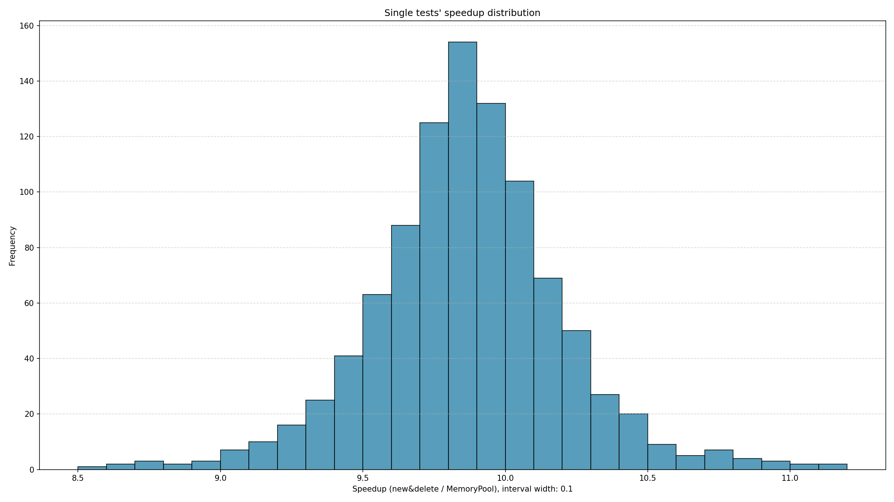
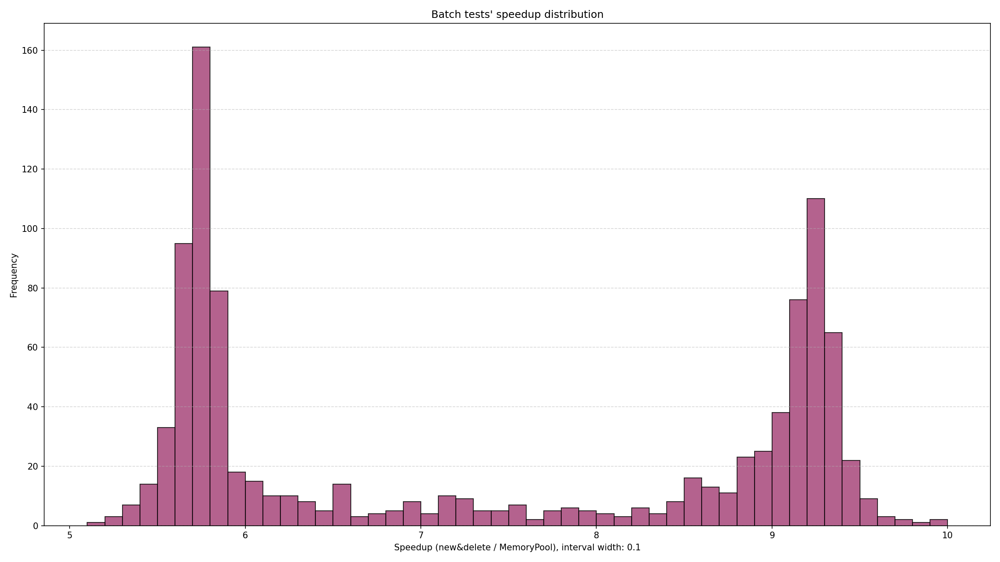

# 内存池及其测试
> 基于 C++ 实现的轻量级通用内存池，在内存分配总量不多的场景下，提供比 new/delete 快 6 倍以上的内存分配性能。

***

## 项目特点
- 采用空闲链表 + 自动扩容的分块管理策略，实现 O(1) 时间复杂度的内存分配和释放
- 支持任意采用标准布局、 平凡可复制的类型
- 实现了较完善的功能测试和性能测试；性能测试使用 IQR 方法过滤测试结果的离群值，单个变量分配加速比平均可达 9 倍，批量分配加速比平均可达 7 倍

***

## 环境要求

### 1. 操作系统
- **Linux**（推荐 Ubuntu 22.04 / Debian 12 / CentOS Stream 9）

### 2. 编译工具
- `g++` 13.1.0+ / `clang++` 15+ （需支持 C++23）

### 3. 依赖库
- C++23 标准库
- Python 3, matplotlib

***

## 快速开始
### 1. 克隆仓库
```bash
git clone https://github.com/C12AK/MemoryPool
cd MemoryPool
```

### 2. 安装依赖
以 Ubuntu 22.04 为例
```bash
sudo apt update
sudo apt install build-essential g++-13 python3 python3-pip
pip3 install matplotlib
```

### 3. 编译功能测试
```bash
g++-13 -std=c++23 -o ftest -Wall -Wextra functional_test.cpp
```

### 4. 运行功能测试
```bash
./ftest
```
预期输出：
```
Basic allocate & deallocate passed.
Multi-block allocate passed.
Free list passed.
Struct passed.
Done.
```

### 5. 编译性能测试
```bash
g++-13 -std=c++23 -O2 -DNDEBUG -o ptest performance_test.cpp
```

### 6. 运行性能测试并绘制图表
```bash
python3 plot_perf.py
```
程序将执行 1000 次测试并生成两个直方图文件，效果如下：



### 7. 清除编译产物
```bash
rm -f ftest ptest
```

***

## 使用方法

**1. 创建内存池**
```cpp
#include "memory_pool.hpp"

// 默认 BLOCK_SIZE = 4096 字节
MemoryPool<int> pool;

// 自定义 BLOCK_SIZE = 256 字节
MemoryPool<double, 256> pool2;
```

**2. 分配内存**
```cpp
int* ptr = pool.allocate();
if (ptr != nullptr) {
    *ptr = 114514;  // 直接使用
}
```

**3. 释放内存**
注意：用户需自己保证不重复释放同一块内存
```cpp
pool.deallocate(ptr);
pool.deallocate(nullptr);   // 安全，无需判空
```
